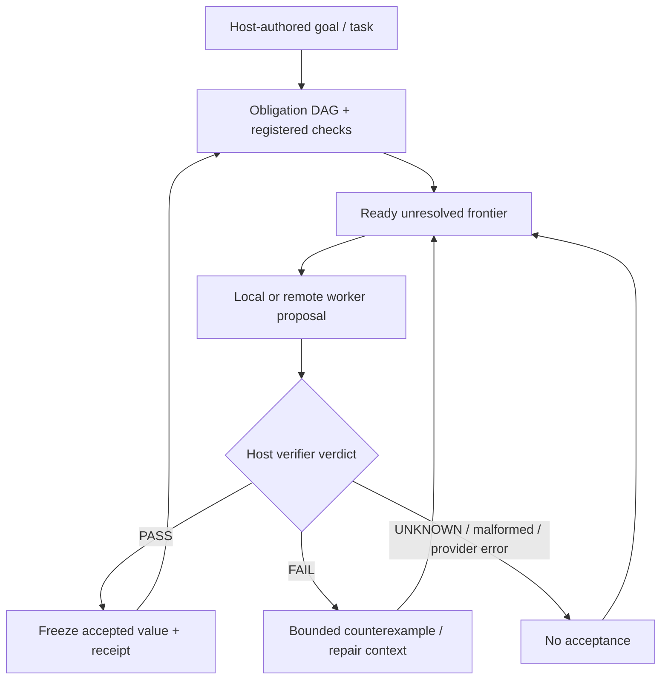

# RESIDUAL core harness

**A verifier-first harness that delegates unresolved work without giving the worker acceptance authority.**

This document describes the original/core RESIDUAL harness layer. The repository has expanded into Command Station, Factory M2/M3/M4, Mission Control/WebVM, evaluation infrastructure and bounded self-maintenance research. For repository-wide qualification claims, use [`docs/CURRENT_STATUS.md`](docs/CURRENT_STATUS.md).

## Core model

RESIDUAL decomposes a host-authored task into checked obligations. Local or remote workers propose results; the controller accepts only results that pass registered checks. Stronger or more expensive workers receive the unresolved frontier, relevant dependency values and bounded failure/evidence context rather than unilateral authority over accepted state.



The worker may be capable, weak, stochastic or wrong. The controller owns acceptance.

## Run the core harness

```bash
python3 -m residual demo
python3 -m residual verify-trace runs/latest/trace.jsonl --result runs/latest/result.json
python3 -m residual benchmark --output runs/benchmark.json
python3 -m unittest discover -s tests -v
```

The built-in demo is scripted and credential-free. It demonstrates controller behavior and evidence handling; it is not a live-model accuracy benchmark.

## Core controller invariants

| Mechanism | Implemented behavior |
| --- | --- |
| Residual frontier | Escalated workers receive unresolved, currently solvable obligations rather than already accepted independent work |
| Independent checks | Model confidence and self-declared success do not accept a result |
| Counterexample feedback | Failed checks provide bounded task-specific failure information |
| Evidence pull | Workers request permitted evidence windows rather than arbitrary source access |
| Frozen accepted values | Later responses cannot silently overwrite accepted obligations |
| Dependency receipts | Accepted values bind to relevant contracts, evidence and parent receipts |
| Revalidated cache | Cache hits are checked again against current inputs and verifier state |
| Explicit budgets | Calls, request bytes and output limits are bounded before provider I/O |
| Honest accounting | Reported usage, modeled estimates and unknown usage remain distinct |
| Claim discipline | `FAIL`, `UNKNOWN`, `BLOCKED`, malformed output, verifier exceptions and provider errors do not become `PASS` |

## Relationship to the broader platform

- **Command Station** provides operator-facing mission/run/provider control.
- **Factory M2** provides bounded worker contracts/runtime and host-owned termination.
- **Factory M3** provides Station-issued evidence/receipt handoff.
- **Factory M4** provides deterministic integration/scheduler authority and capable-runner qualification machinery.
- **Mission Control/WebVM** provides browser-facing real-guest workflows, artifact interaction, provider transport, recovery, diagnostics, and an iOS/WebKit pre-boot walkthrough fallback.
- **Evaluation/research** provides frozen workloads, statistics, fault campaigns, evidence bundles and economics/observability surfaces.

## Current repository boundary

Current `main` is **`3cff6bcd52e352a6ba048c958949a7bbb2a039eb`**, produced by merged PR **#197** on top of #248.

Merged **#200** hardens native setup defaults: persistent XDG locations, loopback Station binding, opt-in shell convenience, bounded venv repair, and constrained shell-rc edits. This is accepted onboarding behavior, not blank-environment qualification.

Merged **#205** restores the private provider channel across Mission Control reload/remount by validating and reusing a session-scoped channel token, and clears it on explicit close. This is accepted lifecycle behavior, not live-provider semantic evidence.

Merged **#218** applies bounded repair-loop lessons to Station. A repair attempt may receive the previous failed candidate's declared writable files as bounded context, with retained file hashes, while the next candidate still starts from a clean baseline worktree. The runner contract separates its JSON transport envelope from literal file-language content, and Mission Control/Store use a shared five-attempt ceiling. The change does not grant workers review, receipt, integration, promotion, verifier, or Factory/M4 authority.

Merged **#201** accepts the guided frontend/provider UX: the public site separates guided proof from the interactive WebVM lab, Mission Control keeps Puter setup inline, authorization remains attached to explicit user gesture, credentials remain outside RESIDUAL, and provider protocol validation remains fail-closed.

Merged **#233** preserves actionable Station repair failure context and explicitly detects repeated failed patches. That makes repair behavior more legible and prevents an identical failed patch from being mistaken for progress; it does not widen acceptance authority.

Merged **#248** qualifies a more explicit provider-load lifecycle on the accepted frontend path: load generations advance monotonically, state transitions are explicit, activation remains bound to the intended credentialless provider frame, and the negative network path must show that a load was actually requested before failing closed. It does not establish real Puter login or paid/live semantic inference.

Merged **#197** hardens the PR Agent as advisory review through workflow/configuration changes only. It does not modify runtime behavior, provider semantics, Factory/M4, verifier authority, evidence schemas, or acceptance authority.

Exact current `main@3cff6bcd...` has six successful ordinary push workflows in their named scopes. The newest retained **production Pages acceptance** remains run `35363306307` on its parent `main@de7d9774...`, and remains **FAIL**. Generated desktop+narrow proof and deployment passed; published acceptance later timed out because provider sign-in remained disabled. Retained evidence records `cloud_inference: NOT_RUN` and identifies the path as a test double rather than paid inference.

The trace for that production failure supports a repository/UI provider-bootstrap race. It does not establish a Puter outage, a real authentication failure, model-quality failure, or paid/live inference result.

PR **#253** is closed unmerged. Its current-main replacement, open **#260**, is rebuilt directly on exact `main@3cff6bcd...`. #260's applicable exact-head technical workflows are **PASS**, including Browser VM Demo CI and Deploy GitHub Pages; its exact-head maintainer approval gate is **FAIL / pending matching attestation**. PR-head Pages PASS is not production proof. If #260 is accepted, the resulting merged SHA requires its own first published Pages acceptance attempt.

Historical failures remain retained evidence rather than being erased by later PASS results.

## Live provider / WebVM boundary

Historical retained real-account iPhone/WebKit + Puter mission `m-b98fe1b9beb440cdb1b8dfe855ad5778` reached `openai/gpt-5.4-nano` twice. Both counted calls failed closed as `provider_protocol_invalid`; no candidate crossed the protocol boundary, so candidate correctness and semantic verification remain **UNKNOWN**.

Merged #179, #183, #189, #205, #201 and #248 improve bounded build-output, provider-session, publication, reload-recovery, guided setup and provider-load lifecycle surfaces. None is retained proof of successful paid/live Puter inference. A fresh exact-deployed-revision real-account mission must reach normal candidate/verifier/receipt handling before live-provider success becomes `PASS`.

The #186 fallback remains accepted: detected iOS/iPadOS WebKit is routed to the lightweight walkthrough before heavyweight guest boot. Physical heavyweight-WebVM reliability and the lower-level process-kill cause remain **UNKNOWN / unqualified**. Issues #120/#126 remain open.

## Factory and trust-boundary constraints

M2/M3/M4 are implemented and `implementation-status.yaml` remains an implementation-presence manifest. M4 qualification is exact-revision/environment bound; namespace/capability-unavailable execution is `BLOCKED`/`UNKNOWN`, not `PASS`.

Accepted #185/#187 protected changes retain their reviewed scope. Keep them distinct from the separate #139→ownership-baseline→fresh-qualification→#134 protected sequence. A green hosted lane does not establish every-host qualification.

This documentation does not alter Factory/M4 implementation/tests, ownership baselines, qualification anchors, protected bytes, verifier authority, or evidence schemas.

## Research boundary

Recent research evidence remains mixed:

- #202 retains an earlier heterogeneous-DAG **FAIL** and a later bounded corrected exact-head **PASS**. Neither erases the other.
- #203/#204 and #215/#217 remain retained M6 **FAIL** results.
- #220 M6-SPEC-006 remains a bounded exact-head **PASS** on the corrected #218 runtime. It does not establish general repair reliability or autonomous self-maintenance.
- #231 M6-ROADMAP-001B is a bounded research **PASS** against a detached clean copy of exact `main@260b5f9...`: one implementation attempt, 3/3 immutable checks PASS, independent local review APPROVED, exact reviewed head integrated, verification receipt issued, and release export succeeded.
- Production PR **#243** remains open. Its current source derives from #231 but adds maintainer hardening that recursively freezes the `acceptance` graph and therefore no longer claims byte-for-byte identity with the generated source. Its applicable technical PR-head workflows pass while the exact-head maintainer approval gate is **FAIL / pending matching attestation**. Accepted production behavior remains **UNKNOWN / unaccepted**.
- #232 M6-EPI-001 completed both experiment arms after one repair but surfaced stricter verifier requirements. That is useful research evidence, not production qualification.
- #244/#246 failed before discovery because of provider timeout. #249 reached discovery but malformed/repeated/truncated candidates exhausted its bounded repair budget. #250/#251/#252/#254 moved to typed structured proposals but still **FAILed** deterministic admission because they described already-measured metrics as missing.
- **#255 / M6-SPEC-007H** reached semantic review with a genuinely absent-metric-shaped MeasurementGap but was rejected for causal overclaim, non-falsifiable acceptance, and preservation-criteria defects: bounded **FAIL**, no receipt.
- **#256 / 007I** and **#258 / 007K** are experiment-apparatus **FAILs** (stale task ID and pre-model variable-name defect). They do not test the Scientist hypothesis to a proposal.
- **#257 / M6-SPEC-007J** is a bounded autonomous-discovery **PASS at formal admission**. Local `qwen2.5:7b` proposed a MeasurementGap for genuinely absent `context_bytes_non_success_max`; semantic review approved it and receipt `09f3bbc0dba17ca7344b485cf4a8757dc11382e0ac2f6b46ece8fb7f74bd80c9` was issued. This is one bounded admission path, not general autonomous discovery.
- **#259 / 007L**, **#262 / 007M**, and **#263 / 007N** are bounded **FAILs** after closing the admitted gap and adding host evidence resolution/active evidence selection. The host exposed/resolved present measurements, but the Scientist kept requesting metrics already present and eventually repeated already-resolved requests. No later admission receipt was issued.
- #207 campaign B still retains independent accounting/release authority-ordering defects. Later repair/self-host PASS results do not clear them.

The latest evidence narrows the claim: one bounded autonomous MeasurementGap admission has **PASSed**, but follow-up evidence-use/repair remains unreliable. General autonomous improvement discovery and recursive self-improvement remain **UNKNOWN / not established**.

## Governance boundary

Merged #168 establishes the repository's solo-maintainer approval model:

`implementation → automated qualification/review → exact-head maintainer attestation → merge`

It is **maintainer-reviewed with automated qualification**, not independent human assurance. A release, security or scientific claim may still require independent evidence.

## Evaluation guidance

The scripted benchmark remains useful as a controller regression fixture, not as evidence of live LLM reliability, token savings or API cost. Confirmatory research must bind results to exact source, workload, execution identity, verifier policy and retained artifacts.

Start with:

- [`docs/evaluation.md`](docs/evaluation.md)
- [`docs/research.md`](docs/research.md)
- [`docs/controlled-evaluation.md`](docs/controlled-evaluation.md)
- [`docs/CURRENT_STATUS.md`](docs/CURRENT_STATUS.md)

## Current scope and non-claims

A passing check establishes only its declared condition. Historical results remain tied to the exact revisions that produced them.

The repository does not currently claim universal worker correctness, guaranteed savings, blanket production readiness, every-host M4 qualification, completed blank-environment/recovery/elapsed-soak qualification, acceptable long-run WebVM reliability, successful exact-current-main paid/live provider execution, physical heavyweight-WebVM iPhone reliability, general autonomous recursive self-improvement, autonomous merge authority, or proof of the central live-model reliability hypothesis.

For operational setup, use [`START-HERE.md`](START-HERE.md). For current repository-wide status, use [`docs/CURRENT_STATUS.md`](docs/CURRENT_STATUS.md).