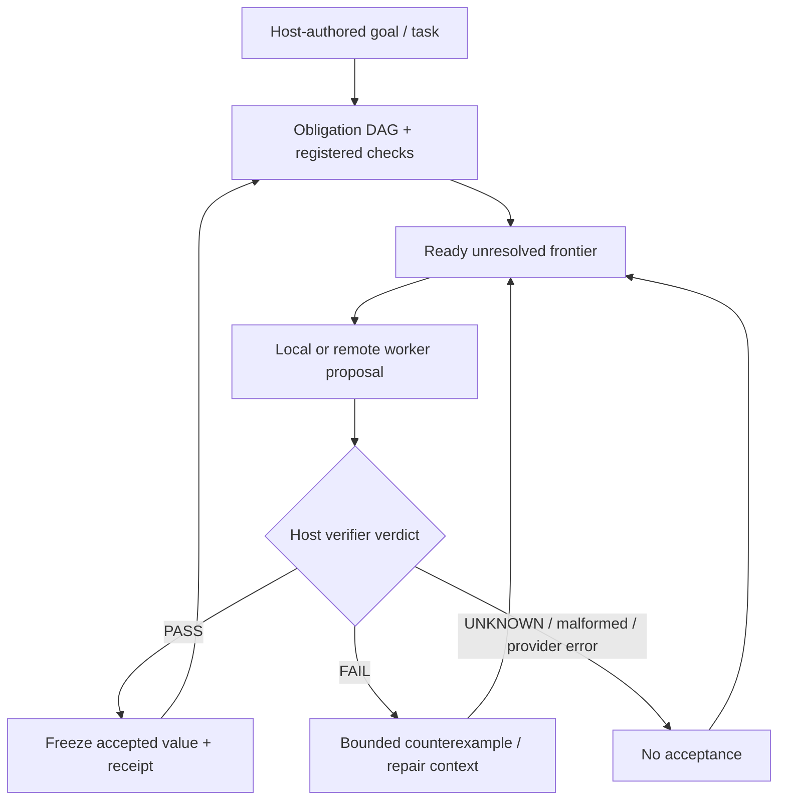

# RESIDUAL core harness

**A verifier-first harness that delegates unresolved work without giving the worker acceptance authority.**

This document describes the original/core RESIDUAL harness layer. The repository has expanded into Command Station, Factory M2/M3/M4, Mission Control/WebVM, evaluation infrastructure and bounded self-maintenance research. For repository-wide qualification claims, use [`docs/CURRENT_STATUS.md`](docs/CURRENT_STATUS.md).

## Core model

RESIDUAL decomposes a host-authored task into checked obligations. Local or remote workers propose results; the controller accepts only results that pass registered checks. Stronger or more expensive workers receive the unresolved frontier, relevant dependency values and bounded failure/evidence context rather than unilateral authority over accepted state.



The worker may be capable, weak, stochastic or wrong. The controller owns acceptance.

## Run the core harness

```bash
python3 -m residual demo
python3 -m residual verify-trace runs/latest/trace.jsonl --result runs/latest/result.json
python3 -m residual benchmark --output runs/benchmark.json
python3 -m unittest discover -s tests -v
```

The built-in demo is scripted and credential-free. It demonstrates controller behavior and evidence handling; it is not a live-model accuracy benchmark.

## Core controller invariants

| Mechanism | Implemented behavior |
| --- | --- |
| Residual frontier | Escalated workers receive unresolved, currently solvable obligations rather than already accepted independent work |
| Independent checks | Model confidence and self-declared success do not accept a result |
| Counterexample feedback | Failed checks provide bounded task-specific failure information |
| Evidence pull | Workers request permitted evidence windows rather than arbitrary source access |
| Frozen accepted values | Later responses cannot silently overwrite accepted obligations |
| Dependency receipts | Accepted values bind to relevant contracts, evidence and parent receipts |
| Revalidated cache | Cache hits are checked again against current inputs and verifier state |
| Explicit budgets | Calls, request bytes and output limits are bounded before provider I/O |
| Honest accounting | Reported usage, modeled estimates and unknown usage remain distinct |
| Claim discipline | `FAIL`, `UNKNOWN`, `BLOCKED`, malformed output, verifier exceptions and provider errors do not become `PASS` |

## Relationship to the broader platform

- **Command Station** provides operator-facing mission/run/provider control.
- **Factory M2** provides bounded worker contracts/runtime and host-owned termination.
- **Factory M3** provides Station-issued evidence/receipt handoff.
- **Factory M4** provides deterministic integration/scheduler authority and capable-runner qualification machinery.
- **Mission Control/WebVM** provides browser-facing real-guest workflows, artifact interaction, provider transport, recovery, diagnostics, and an iOS/WebKit pre-boot walkthrough fallback.
- **Evaluation/research** provides frozen workloads, statistics, fault campaigns, evidence bundles and economics/observability surfaces.

## Current repository boundary

Current `main` is **`60d0c5a8fc2044a22619248292ce89c9b43edd37`**.

Merged **#200** hardens native setup defaults: persistent XDG locations, loopback Station binding, opt-in shell convenience, bounded venv repair, and constrained shell-rc edits. This is accepted onboarding behavior, not blank-environment qualification.

Merged **#205** restores the private provider channel across Mission Control reload/remount by validating and reusing a session-scoped channel token, and clears it on explicit close. This is accepted lifecycle behavior, not live-provider semantic evidence.

Merged **#218** applies bounded repair-loop lessons to Station. A repair attempt may receive the previous failed candidate's declared writable files as bounded context, with retained file hashes, while the next candidate still starts from a clean baseline worktree. The runner contract separates its JSON transport envelope from literal file-language content, and Mission Control/Store use a shared five-attempt ceiling. The change does not grant workers review, receipt, integration, promotion, verifier, or Factory/M4 authority.

Merged **#201** accepts the guided frontend/provider UX: the public site separates guided proof from the interactive WebVM lab, Mission Control keeps Puter setup inline, authorization remains attached to explicit user gesture, credentials remain outside RESIDUAL, and provider protocol validation remains fail-closed.

Merged **#233** preserves actionable Station repair failure context and explicitly detects repeated failed patches. That makes repair behavior more legible and prevents an identical failed patch from being mistaken for progress; it does not widen acceptance authority.

PR #233's exact head `8801d5e0...` passed Deploy GitHub Pages, Control Plane, clean install, Factory ownership, measured-evaluation binding, Controller/provider, Command Station, and exact-head maintainer approval before merge.

Exact merged `main@60d0c5a8...` has seven ordinary push workflows: six succeeded, while **Deploy GitHub Pages run `35349614961` is FAIL in published live-acceptance scope**. Build/browser proof and deployment passed. Published desktop acceptance passed served-artifact identity, guest boot, demo verification, warm reload, and repository audit, then timed out waiting for the embedded provider frame's expected `could not load` state. The retained provider proof used a test-double SDK, so the failure is not evidence for or against successful paid/live Puter inference.

Historical failures remain retained evidence rather than being erased by later PASS results.

## Live provider / WebVM boundary

Historical retained real-account iPhone/WebKit + Puter mission `m-b98fe1b9beb440cdb1b8dfe855ad5778` reached `openai/gpt-5.4-nano` twice. Both counted calls failed closed as `provider_protocol_invalid`; no candidate crossed the protocol boundary, so candidate correctness and semantic verification remain **UNKNOWN**.

Merged #179, #183, #189, #205 and #201 improve bounded build-output, provider-session, publication, reload-recovery, and inline setup/authorization surfaces. None is retained proof of successful paid/live Puter inference. A fresh exact-deployed-revision real-account mission must reach normal candidate/verifier/receipt handling before live-provider success becomes `PASS`.

The #186 fallback remains accepted: detected iOS/iPadOS WebKit is routed to the lightweight walkthrough before heavyweight guest boot. Physical heavyweight-WebVM reliability and the lower-level process-kill cause remain **UNKNOWN / unqualified**. Issues #120/#126 remain open.

## Factory and trust-boundary constraints

M2/M3/M4 are implemented and `implementation-status.yaml` remains an implementation-presence manifest. M4 qualification is exact-revision/environment bound; namespace/capability-unavailable execution is `BLOCKED`/`UNKNOWN`, not `PASS`.

Accepted #185/#187 protected changes retain their reviewed scope. Keep them distinct from the separate #139→ownership-baseline→fresh-qualification→#134 protected sequence. A green hosted lane does not establish every-host qualification.

This documentation does not alter Factory/M4 implementation/tests, ownership baselines, qualification anchors, protected bytes, verifier authority, or evidence schemas.

## Research boundary

Recent research evidence remains mixed:

- #202 retains an earlier heterogeneous-DAG **FAIL** and a later bounded corrected exact-head **PASS**. Neither erases the other.
- #203/#204 and #215/#217 remain retained M6 **FAIL** results.
- #220 M6-SPEC-006 remains a bounded exact-head **PASS** on the corrected #218 runtime. It does not establish general repair reliability or autonomous self-maintenance.
- #231 M6-ROADMAP-001B is a bounded research **PASS** against a detached clean copy of exact `main@260b5f9...`: one implementation attempt, 3/3 immutable checks PASS, independent local review APPROVED, exact reviewed head integrated, verification receipt issued, and release export succeeded. The exact generated `ImprovementSpec` bytes are proposed in production PR #243, which is still open and therefore **unaccepted**.
- #232 M6-EPI-001 completed both experiment arms after one repair, but surfaced stricter verifier requirements: an empty invariant set in the insufficient-evidence arm and malformed/conflated acceptance/invariant semantics in the sufficient-evidence arm. That is a useful research result, not production qualification.
- #244 M6-SPEC-007 and #246 M6-SPEC-007B both timed out at the provider before any autonomous discovery proposal was produced. Treat them as **FAIL in experiment-execution scope / discovery not reached**, not as a failed Scientist hypothesis. #246 reduced request size but did not clear the timeout.
- #249 M6-SPEC-007C has no authoritative result retained at this status check, so its discovery outcome is **UNKNOWN**.
- #207 campaign B still retains independent accounting/release authority-ordering defects. #218/#220/#231 do not clear them.

These observations do not establish general autonomous recursive self-improvement or production reliability.

## Governance boundary

Merged #168 establishes the repository's solo-maintainer approval model:

`implementation → automated qualification/review → exact-head maintainer attestation → merge`

It is **maintainer-reviewed with automated qualification**, not independent human assurance. A release, security or scientific claim may still require independent evidence.

## Evaluation guidance

The scripted benchmark remains useful as a controller regression fixture, not as evidence of live LLM reliability, token savings or API cost. Confirmatory research must bind results to exact source, workload, execution identity, verifier policy and retained artifacts.

Start with:

- [`docs/evaluation.md`](docs/evaluation.md)
- [`docs/research.md`](docs/research.md)
- [`docs/controlled-evaluation.md`](docs/controlled-evaluation.md)
- [`docs/CURRENT_STATUS.md`](docs/CURRENT_STATUS.md)

## Current scope and non-claims

A passing check establishes only its declared condition. Historical results remain tied to the exact revisions that produced them.

The repository does not currently claim universal worker correctness, guaranteed savings, blanket production readiness, every-host M4 qualification, completed blank-environment/recovery/elapsed-soak qualification, acceptable long-run WebVM reliability, successful exact-current-main paid/live provider execution, physical heavyweight-WebVM iPhone reliability, general autonomous recursive self-improvement, autonomous merge authority, or proof of the central live-model reliability hypothesis.

For operational setup, use [`START-HERE.md`](START-HERE.md). For current repository-wide status, use [`docs/CURRENT_STATUS.md`](docs/CURRENT_STATUS.md).