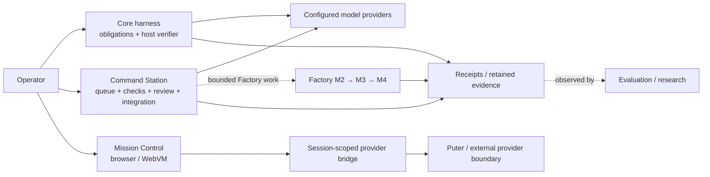

# RESIDUAL

**Build reliable AI systems from unreliable computation.**

RESIDUAL is an evidence-first reliability and control plane for AI-assisted engineering. Workers propose bounded work; the harness owns acceptance. Execution is observed, evidence is retained, candidate outputs are checked, and only accepted state is allowed across controlled integration boundaries.

> **AI reliability does not necessarily require making each individual model reliable. Reliability can emerge from constraining, observing, verifying, and deterministically integrating unreliable computation.**

For exact current claims, start with [`docs/CURRENT_STATUS.md`](docs/CURRENT_STATUS.md).

## What is implemented

RESIDUAL spans a connected platform rather than a single agent loop:

- **Core harness:** obligation DAGs, verifier-defined acceptance, residual delegation, evidence negotiation, receipts, bounded budgets, cache revalidation and tamper-evident traces.
- **Command Station:** self-hosted mission/run control, provider/model management, observations, HITL hooks, evidence export and operational UI.
- **Mission Control / WebVM:** browser-facing real-guest workflows, artifact conversations, provider transport, persistent guest-worker execution, fail-closed runtime handling, fresh-overlay recovery, privacy-safe local diagnostics, and an iOS/WebKit pre-boot walkthrough fallback.
- **Factory M2/M3/M4:** bounded worker contracts/runtime, Station-issued evidence/receipts, trusted handoff, deterministic integration/scheduling and capable-runner qualification machinery.
- **Evaluation/research:** frozen workloads, ablations, statistics, fault injection, reproducible evidence bundles, observability/economics tooling and bounded self-maintenance research.

`FAIL`, `UNKNOWN`, `BLOCKED`, malformed output, verifier exceptions, provider failures and abstention do not silently become `PASS`.

### How the pieces fit



The surfaces share evidence-first authority rules, but they are not one mandatory linear pipeline. Provider/model output is a proposal; host-owned verification and integration boundaries determine accepted state.

## Current main

Current `main` is **`60d0c5a8fc2044a22619248292ce89c9b43edd37`**.

Accepted changes in the current documented sequence include:

- **#200** — native setup hardening. The setup path defaults to persistent XDG state, binds Station to `127.0.0.1`, makes the convenience shell macro opt-in, uses bounded venv repair, and constrains shell startup-file edits. This is onboarding hardening, **not** blank-environment qualification or a portability proof.
- **#205** — WebVM provider-channel recovery. Mission Control restores the private provider channel token from `sessionStorage` across reload/remount, validates it fail-closed, reuses it only for the active browser session, and clears it on explicit close. This is accepted provider-session lifecycle behavior, **not** retained proof of live Puter inference.
- **#218** — bounded Station repair-loop remediation. Repair attempts may receive the previous failed candidate's declared writable files as bounded context while each new attempt still starts from a clean baseline worktree; repair-context hashes are retained, the runner contract separates the transport JSON envelope from file-language content, and Mission Control/Store share a bounded five-attempt ceiling. This does **not** weaken verifier, review, receipt, integration, quarantine, promotion, Factory/M4, or acceptance authority.
- **#201** — frontend/guided-provider UX. The public site separates guided proof from the interactive WebVM lab, animates real RESIDUAL CLI commands with reduced-motion support, and Mission Control keeps Puter setup inline while allowing Puter's secure authorization popup under explicit user gesture. Provider loading remains lazy, credentials stay outside RESIDUAL, and protocol handling remains fail-closed.
- **#233** — Station repair diagnostics. Failed attempts retain an actionable failure tail and repeated failed patches are detected explicitly so a repair loop does not silently lose the root cause or treat an identical failed patch as progress. The change does not grant worker, review, receipt, integration, promotion, verifier, or Factory/M4 authority.

PR #233's exact head `8801d5e0...` completed **PASS** for Deploy GitHub Pages, Control Plane, clean install, Factory ownership, measured-evaluation binding, Controller/provider, Command Station, and the exact-head maintainer approval gate before merge.

Exact merged `main@60d0c5a8...` has seven ordinary push workflows: six completed successfully, while **Deploy GitHub Pages run `35349614961` is FAIL in published live-acceptance scope**. The Pages artifact build/browser proof and deployment itself succeeded. Published desktop acceptance then passed served-artifact identity, guest attachment/shell readiness, real demo verification, warm reload, and repository audit, before timing out waiting for the embedded provider frame to expose the expected `could not load` status. The retained provider path was `REAL_GUEST_WITH_TEST_DOUBLE_SDK_NOT_PAID_INFERENCE`, so this failure establishes neither paid/live Puter semantic success nor paid/live Puter semantic failure.

Historical failures remain evidence even when later revisions pass.

## Live-provider and WebVM boundary

Historical retained real-account iPhone/WebKit + Puter mission `m-b98fe1b9beb440cdb1b8dfe855ad5778` reached `openai/gpt-5.4-nano` twice, but both counted calls ended `provider_protocol_invalid`. No candidate crossed the protocol boundary; candidate correctness and semantic verification remain **UNKNOWN**.

Merged #179, #183, #189, #205 and #201 repair or improve bounded build-output, provider-session, publication, reload-recovery, and inline setup/authorization surfaces. None is retained proof of successful paid/live Puter inference. A fresh real-account mission on the accepted deployed revision must cross provider protocol validation and proceed through normal candidate/verifier/receipt handling before live-provider success can become `PASS`.

The accepted #186 fallback routes detected iPhone/iPadOS WebKit to the lightweight walkthrough before heavyweight WebVM boot. This is not proof that heavyweight WebVM is reliable on physical iPhone Safari. Issues #120/#126 and long-run WebVM reliability remain open.

## Factory / M4 boundary

M2/M3/M4 are implemented. `implementation-status.yaml` is an implementation-presence manifest; implementation is not equivalent to every-host or production qualification.

Accepted #185/#187 protected-byte and ownership-baseline changes retain their exact reviewed scope. The separate #139→ownership-baseline→fresh-qualification→#134 protected sequence remains independent. This documentation does not modify Factory/M4 implementation or tests, ownership baselines, qualification anchors, protected bytes, verifier authority, or evidence schemas.

## Research evidence boundary

Research results are revision-bound and deliberately mixed:

- Draft #202 retains an earlier heterogeneous-DAG **FAIL** and a later distinct exact-head bounded **PASS** using real local models for a three-task DAG with forced repair. The later PASS does not erase the earlier FAIL or establish general DAG/recovery reliability.
- Draft #203/#204 and #215/#217 remain retained M6 **FAIL** results.
- Draft #220 M6-SPEC-006 remains a bounded **PASS** on the corrected #218 runtime using local Qwen2.5-Coder 7B: attempts 1 and 2 were rejected, attempt 3 passed the frozen checks, independent Station review approved it, 1/1 integrated, a verification receipt was issued, and release export completed. This does not establish general autonomous self-maintenance.
- **#231 / M6-ROADMAP-001B** is a research **PASS** against a detached clean copy of exact `main@260b5f9...`: one implementation attempt, 3/3 immutable checks PASS, independent local review APPROVED, exact reviewed head integrated, a verification receipt was issued, and release export succeeded. The exact generated `ImprovementSpec` bytes are proposed for production in **#243**, which remains open and unmerged; therefore the production contract is **not yet accepted main behavior**.
- **#232 / M6-EPI-001** completed its two-arm research experiment successfully after one repair per arm, but it also exposed verifier requirements: the insufficient-evidence arm left `preserve_invariants` empty, while the sufficient arm used free-form acceptance prose and conflated a performance metric with a protected invariant. Those outputs are research findings, not proof that the production HypothesisVerifier exists or is qualified.
- **#244 / M6-SPEC-007** and **#246 / M6-SPEC-007B** both failed before autonomous discovery began because the local provider timed out at roughly 300 seconds before a proposal was produced. They are **FAIL in experiment-execution scope / discovery not reached**, not evidence that the Scientist hypothesis failed. #246 reduced the first request from 15,566 to 12,927 bytes but still timed out.
- **#249 / M6-SPEC-007C** is pending with no authoritative result retained at this status check, so its discovery outcome remains **UNKNOWN**.
- Draft #207 campaign B retains negative governance evidence: budget/release authority-ordering defects remain open until an accepted repair is requalified.

These are research/development observations, not production qualification. See [`docs/research.md`](docs/research.md) and [`docs/evaluation.md`](docs/evaluation.md).

## Governance boundary

Merged **#168** establishes the repository's solo-maintainer control model:

`implementation → automated qualification/review → exact-head maintainer attestation → merge`

Describe that as **maintainer-reviewed with automated qualification**. It is not independent human assurance. Claim-specific independent or third-party evidence remains required wherever a security, release or research claim depends on it.

## Quick start

### Command Station

Windows: **Start-Station.cmd**  
macOS: **Start-Station.command**  
Linux: `bash Start-Station.sh`

With Docker running, the launcher serves the Station UI at `http://localhost:8765`. Native mode requires Python 3.11+ and Git:

```bash
python3 -m residual.station.server --open
# or
python3 -m residual serve --open
```

The accepted `setup.sh` path is an optional native convenience path; it does not remove the Python 3.11+ host prerequisite or constitute blank-machine qualification.

See [`START-HERE.md`](START-HERE.md) for installation and operator setup.

### Core harness

```bash
python3 -m residual demo
python3 -m residual verify-trace runs/latest/trace.jsonl --result runs/latest/result.json
python3 -m residual benchmark --output runs/benchmark.json
```

## Current priority gates

1. Repair and requalify the exact-`60d0c5a8...` Pages live-acceptance failure. Preserve run `35349614961` as the current merged-SHA FAIL; do not relabel the six successful ordinary push workflows or the green #233 PR head as a Pages PASS.
2. Review and qualify production PR #243 before calling the generated `ImprovementSpec` accepted main behavior. Its current technical PR-head workflows are green, while the exact-head maintainer approval gate is **FAIL/pending attestation**.
3. Continue the remaining M6.2 contracts — EvidenceSnapshot, MeasurementGap, Scientist, deterministic HypothesisVerifier, experiment ledger, and champion/challenger evaluation — while preserving #231/#232 as bounded research evidence and #244/#246 as execution failures before discovery.
4. Resolve M6-SPEC-007C (#249) from retained evidence; until an authoritative result exists, autonomous discovery remains **UNKNOWN / not established**.
5. Repair and requalify the #207/#208 accounting/release-ordering defects before making stronger fail-closed budget/release claims.
6. Retain a fresh real-account Puter candidate→verifier→receipt success on the accepted deployed revision, or keep live-provider success `UNKNOWN`.
7. Physically validate the #186 mobile fallback without broadening it into a heavyweight-WebVM reliability claim.
8. Complete true blank-environment installation, recovery/host-loss qualification, and selected elapsed soak for the exact release artifact.
9. Continue #120/#126 long-run WebVM reliability work and the separate #139→ownership-baseline→#134 protected sequence.
10. Freeze the confirmatory live-evaluation protocol before outcome access, then run R0–R5 and the planned degradation/routing studies.

## Scope and non-claims

RESIDUAL is an implemented research and engineering platform, not a universal proof system. A verifier establishes only the conditions encoded by its contract and evidence. Receipts are evidence of checked acceptance under stated identities and revisions, not certificates of arbitrary truth.

The project does not currently claim universal correctness, blanket production readiness, every-host M4 qualification, completed blank-environment/recovery/elapsed-soak qualification, acceptable long-run WebVM reliability, successful exact-current-main paid/live provider execution, physical heavyweight-WebVM iPhone reliability, general autonomous recursive self-improvement, autonomous merge authority, or live proof of the central research hypothesis.