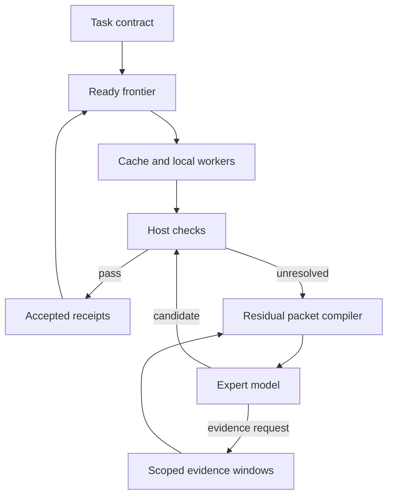

# Architecture and invariants

The scheduling unit is an obligation with an instruction, declared evidence,
accepted dependencies, a host-registered verifier and revision, an optional local
solver, and an explicit remote-disclosure policy.

## Frontier and acceptance

For a task DAG with nodes `V`, let `A` contain accepted obligations. A ready
frontier consists of unaccepted nodes whose declared dependencies are all in `A`.
The controller first revalidates cache entries, then runs optional local solvers,
then a bounded local-model loop. The expert receives the remaining frontier.
Independent branches continue even when another branch cannot complete.

Every proposal is checked on the host. `pass` accepts; `fail` produces a
counterexample; `unknown`, malformed results, verifier exceptions, provider
errors, and abstention never accept. A response addressing any obligation outside
the requested frontier is rejected as a protocol error. Proposals cannot alter
the check, its configuration, existing dependencies, or accepted values.

The accepted set grows monotonically within one evidence snapshot. This does
not guarantee a solution exists, that the model finds it, or that the contract
captures all real-world requirements. If later decisions need to revise a prior
choice, that coupled search belongs within a single obligation in v0.1.

## Packet compilation

The residual packet includes instructions for unresolved nodes, their accepted
direct parents and receipt hashes, verifier feedback, a permitted-artifact
manifest, and exact source excerpts. It excludes unrelated accepted values and
unrelated artifacts. Each request is stateless: a hash is a provenance reference,
not an assumption that the model already knows omitted content.

Fixed-window mode seeds the first `seed_lines` of each declared artifact. A model
may request a precise interval of a declared artifact for an unresolved node.
Requests are bounded in count, range, and resulting request-body size. Windows
are merged to avoid repeating overlapping evidence in one packet.

Adaptive residual also compares a complete scoped capsule with the current seed
packet. It inlines the complete relevant artifact set when its framed size is at
most twice the seed request and it fits both remaining and per-request byte
limits. This is a deterministic heuristic for avoiding unnecessary round trips;
it is not a learned routing policy or an optimal cost bound. Full-context baseline
policies send all eligible evidence for the task.

## Evidence and disclosure

Files are loaded into immutable text snapshots before a run. Resolved paths must
remain within the task directory, including symlinks. Artifacts are local-only
unless marked `cloud: true`. An obligation may cross a remote boundary only if
the obligation, all its artifacts, and every transitive dependency permit it.
Thus a derived value does not lose the privacy restriction of its inputs.
Local calls for exportable work are separated from calls for local-only work,
so the same prompt cannot mix private evidence into an exportable candidate.

The remote packet builder filters both artifact contents and manifest names.
The provider placement check also applies to the nominally local tier. All
non-loopback HTTP adapters must declare remote placement and use HTTPS. Redirects
and ambient proxy forwarding are disabled. A local forwarding service can itself
send information elsewhere; the harness cannot inspect its implementation.

Goals, instructions, verifier messages and explicitly public artifact contents
are authored disclosure surfaces. There is no automatic secret detector or
redaction guarantee. Put sensitive information in local-only artifacts rather
than the goal. Plugins are trusted host code and must declare all their inputs.

## Cache and receipts

Each cache key binds the protocol version, task ID and goal, obligation contract,
verifier revision, declared artifact hashes, and accepted dependency receipts.
A receipt binds that key to a canonical JSON value hash. Parent receipts make
input changes propagate through dependent cache keys. Unrelated artifact changes
do not invalidate an obligation that never declared that artifact.

Cached values are untrusted proposals. The current verifier reruns before every
acceptance. Provider identity is intentionally absent: an answer satisfying the
same contract can be reused across models. If a check depends on external state,
snapshot that state as evidence or refresh the check; a revision string alone is
not a representation of a changing external system.

## Budgets and accounting

Before I/O, the engine reserves a call, an expert call when applicable, and the
serialized request-body bytes for a remote provider. The body includes system
instructions and provider framing, including Ollama's schema. The output-token
limit is sent to the provider. Failed calls retain their reservation because a
timeout can occur after inference has run. There are no invisible HTTP retries.

Reported prompt/completion counts and cache-token counts are stored separately
from simulated or missing counts. Missing usage never becomes a zero-dollar bill.
Configured price tables calculate remote inference cost only; absence of a price
or complete usage produces `null`. Reported output token totals from a provider
must include any separately billed reasoning according to that provider's API.
Custom SDK adapters must map the provider's billing semantics correctly.

Request-byte limits are exact for the built-in adapters' serialized bodies,
excluding HTTP headers/TLS. For a `CallableProvider`, the default size is generic
framing; override `payload`/`wire_size` for exact custom transport accounting.
This is not a universal hard-token or hard-dollar budget.

## Audit limits

The event ledger contains metadata, hashes, verdict codes, request ranges, and
usage. It omits raw prompts, evidence text, and candidate values. `result.json`
does contain accepted values and should follow the source data's access policy.
The final event binds the result JSON, and `verify-trace --result` checks it.

An independently retained `--expected-root` detects whole-ledger rewrites. Without
that root, a consistent hash chain proves internal integrity only. Ledger hashes
are not an identity signature, an external attestation, or a complete replay of
rejected proposals. The runtime is single-process and synchronous.
