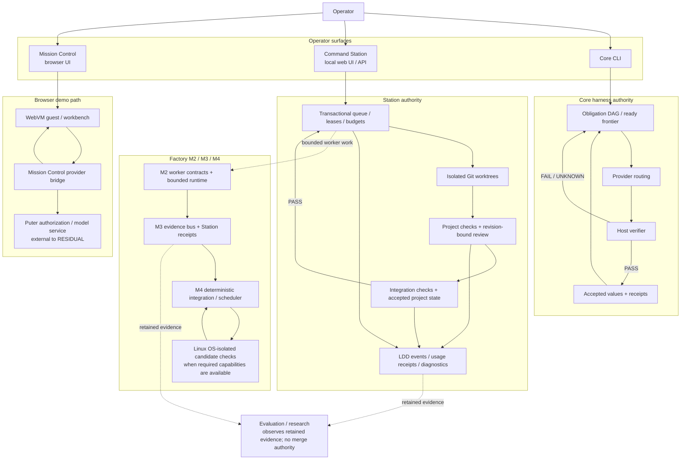
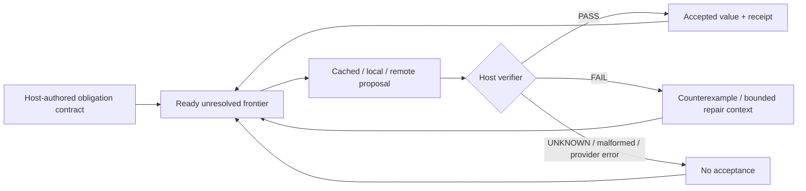
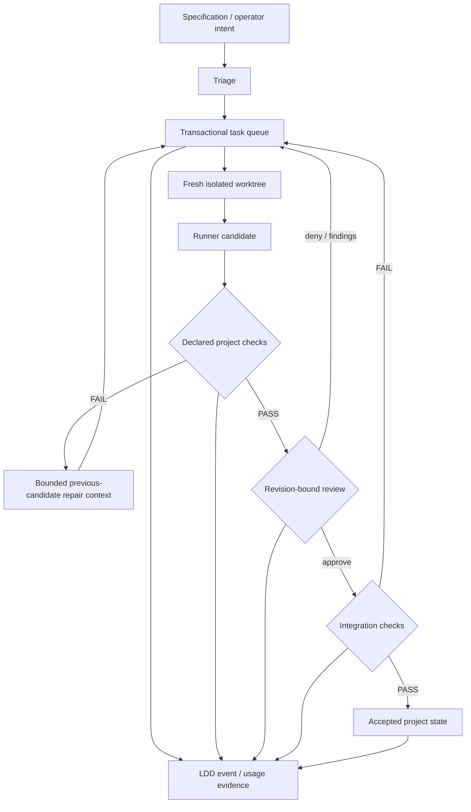
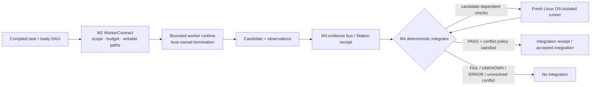
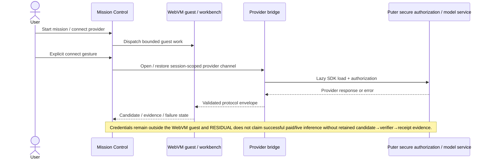
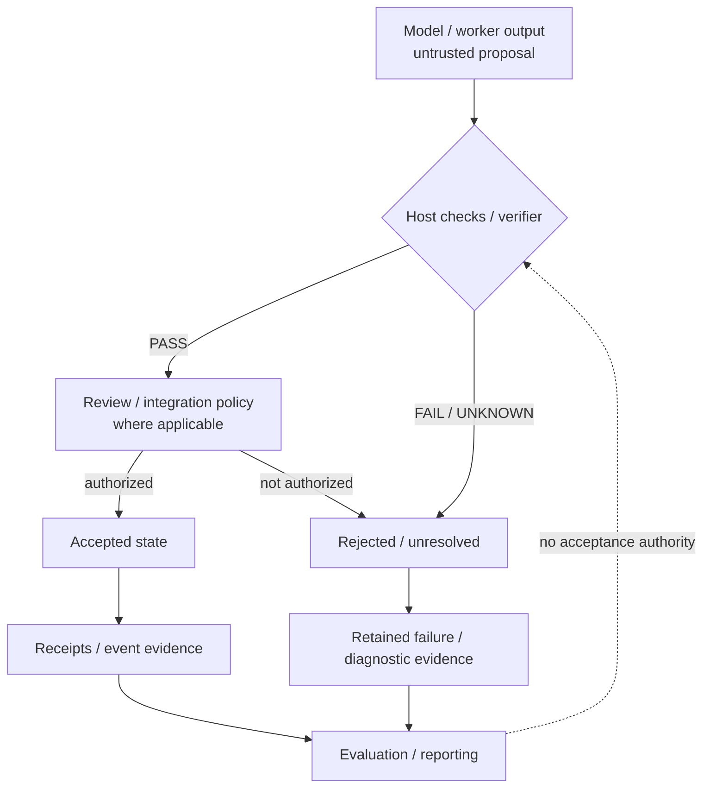
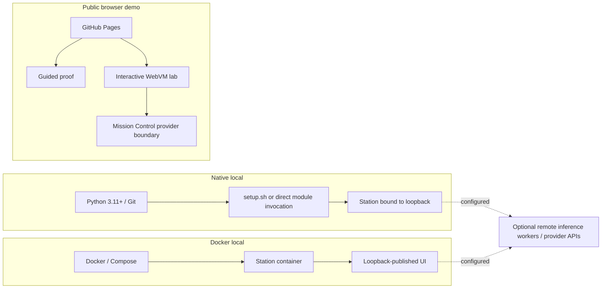

# RESIDUAL architecture diagrams

**Status:** non-normative architecture view
**Validated against:** `main@260b5f9e20bf70a6b9ca087bc91e22a009ed77b9`

These diagrams describe implemented boundaries without turning implementation into release or production qualification. Exact current claims remain in [`../CURRENT_STATUS.md`](../CURRENT_STATUS.md). Historical specifications do not override current code or retained qualification evidence.

## 1. Repository-wide topology

**Important:** the core harness, Command Station, Factory, and Mission Control are related surfaces, not one monolithic linear pipeline. A model/provider proposes work; host-owned checks and integration boundaries decide what becomes accepted state.

## 2. Core obligation acceptance flow

`FAIL`, `UNKNOWN`, malformed output, verifier exceptions, provider errors, and abstention do not become acceptance.

## 3. Command Station task lifecycle

Merged #218 permits bounded repair context from the previous failed candidate's declared writable files, while the next attempt still starts from a clean baseline worktree. Workers do not gain review, verifier, receipt, integration, promotion, or Factory/M4 authority.

## 4. Factory M2 → M3 → M4 trust path

The OS-isolated M4 path is capability- and environment-bound. A host that cannot satisfy the required namespace/sandbox prerequisites is `BLOCKED`/`UNKNOWN`, not silently qualified.

## 5. Mission Control / WebVM provider boundary

Detected iOS/iPadOS WebKit is routed to the lightweight walkthrough before heavyweight WebVM boot under the accepted #186 fallback. That fallback is not proof of heavyweight WebVM reliability on physical iPhone Safari.

## 6. Evidence and authority boundary

Receipts and hash chains provide provenance/integrity evidence under their stated contracts. They are not signatures of arbitrary truth, proof that a model is correct, or blanket production certification.

## 7. Deployment shapes actually represented in the repository

These are architecture shapes, not production-readiness claims. Blank-environment installation, host-loss recovery, elapsed soak, physical-device heavyweight WebVM reliability, and successful exact-current-main paid/live provider execution remain separate qualification questions.
