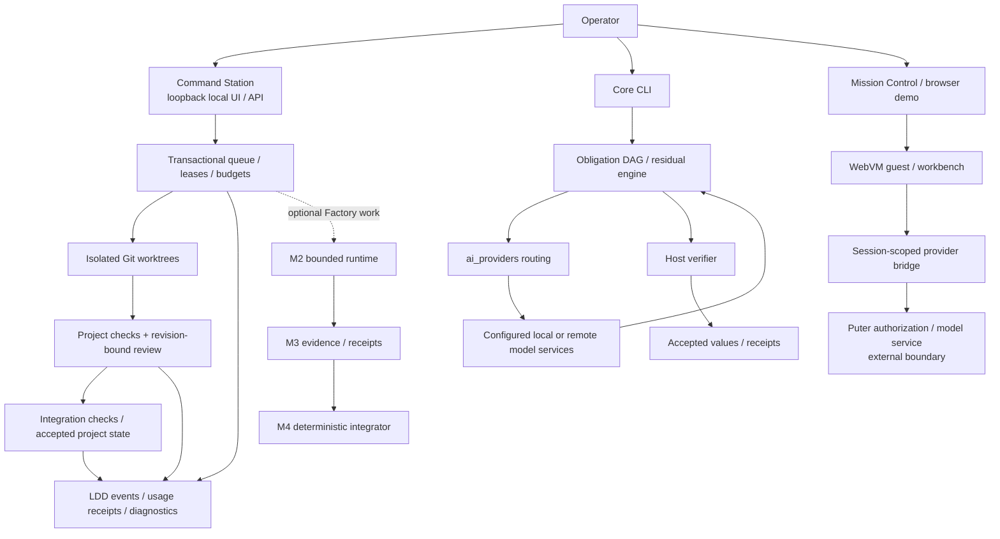
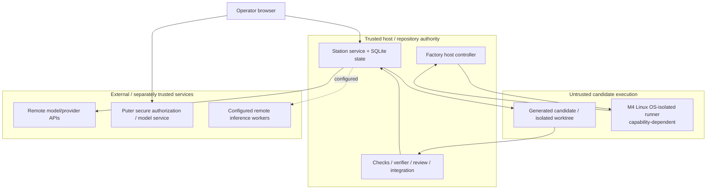
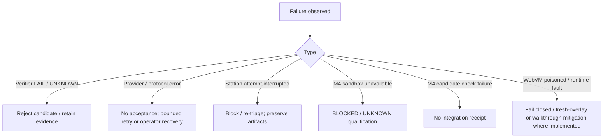

# Architecture Review Package (ENT7-R2)

Requirement: **ENT7-R2** calls for a system diagram, data-flow diagram, security boundary map, failure-mode analysis, scalability analysis, and integration points.

This package separates **implemented repository behavior** from enterprise-spec targets. It does not claim that optional IAM/SSO, HA/DR, marketplace, load targets, or production deployment requirements are qualified merely because they appear in enterprise specifications.

See also [`../ARCHITECTURE_DIAGRAMS.md`](../ARCHITECTURE_DIAGRAMS.md) and [`../../CURRENT_STATUS.md`](../../CURRENT_STATUS.md).

## 1. Implemented system boundary



Command Station, the core harness, Factory, and Mission Control are related but distinct control surfaces. Do not infer that every task traverses every box.

## 2. Accepted-state data flow

```mermaid
flowchart LR
  Intent["Host / operator intent"] --> Contract["Task or obligation contract"]
  Contract --> Candidate["Worker / model candidate"]
  Candidate --> Verify{"Host-owned checks"}
  Verify -->|FAIL / UNKNOWN / malformed| No["No accepted-state change"]
  Verify -->|PASS| Review{"Review / integration policy<br/>where required"]
  Review -->|deny / conflict / failed integration check| No
  Review -->|authorized| State["Accepted state"]
  State --> Evidence["Receipt / event evidence"]
  No --> Evidence
```

Not every core-harness obligation uses Station review/integration; that gate applies to Station/Factory project integration where configured. The invariant shared across the platform is that worker/model self-declaration does not itself authorize accepted state.

## 3. Security boundary map



| Boundary | Current control | Qualification caveat |
| --- | --- | --- |
| Browser ↔ local Station | Loopback binding by default; session token plus Host/Origin enforcement for writes | Trusted single-user local app; not a hardened multi-tenant internet service |
| Station/core ↔ remote providers | Explicit provider placement/disclosure rules, bounded transport/accounting, response validation | A configured local forwarder can itself disclose data; live-provider semantic success is separately qualified |
| Candidate ↔ host | Isolated Git worktrees; deterministic checks; stripped credentials for native project commands | Native checks are not an OS sandbox |
| M4 candidate checks ↔ host | Fresh Linux namespace/chroot/resource-limited sandbox on capable runners | Missing required capabilities are `BLOCKED`/`UNKNOWN`, not PASS |
| Mission Control ↔ Puter | Session-scoped provider channel; explicit user gesture for authorization; credentials remain outside WebVM guest | Exact-current-main paid/live candidate→verifier→receipt success is not established |
| Evidence ↔ claims | Receipts, hashes, revision identities, retained failures | Hash chains are integrity/provenance evidence, not arbitrary-truth certificates |

## 4. Failure and containment paths



Current open reliability and release boundaries are tracked in `docs/CURRENT_STATUS.md`; a mitigation or successful rerun is not automatically root-cause closure.

## 5. Scalability boundary

The repository contains concurrency, remote-worker, mesh, scheduler, and evaluation surfaces, but this package does **not** assert the old unverified figures such as “~1k concurrent tasks,” “10k receipts/day,” or p95 dispatch targets as measured capability. Treat such figures in historical enterprise specs as targets until a retained load campaign establishes them.

Implemented scaling mechanisms include dependency-wave execution in Station, parallel implementation requests, bounded leases, optional remote inference workers, Factory scheduling/evidence surfaces, and provider routing. Production multi-node guarantees, HA/DR behavior, throughput SLOs, and capacity limits remain deployment- and evidence-specific.

## 6. Integration points

| Integration | Current status | Mechanism / boundary |
| --- | --- | --- |
| Local model services such as Ollama | Implemented | `ai_providers` adapters/router and Station model dispatch |
| Remote model/provider APIs | Implemented when configured | HTTPS/provider adapters with placement/disclosure and budget controls |
| Puter browser provider path | Implemented browser boundary | Mission Control provider bridge; live semantic success remains separately qualified |
| Observation / diagnostics | Implemented | `observation_layer`, Station LDD events, diagnostics APIs and retained artifacts |
| Remote inference workers | Implemented development surface | Separate worker credentials; trusted remote-worker deployment guidance applies |
| IAM / SSO / SCIM | Enterprise-spec surface, not assumed in the base local Station | Do not present as a default current control without deployment-specific evidence |
| HA/DR / standby failover | Enterprise-spec / release target | Not established by the base repository architecture alone |
| Module marketplace / commercial licensing | Specification/product planning surface | Not an accepted runtime dependency for core qualification |

## 7. ARB use

For an architecture review, attach exact deployment details separately: network exposure, TLS termination, enabled providers, secrets storage, remote-worker topology, OS/container boundary, data classification, and the exact retained qualification evidence for the revision being proposed.

This package is suitable as a repository architecture baseline. It is **not** a statement that site-specific enterprise controls, production SLOs, or release qualification are complete.
