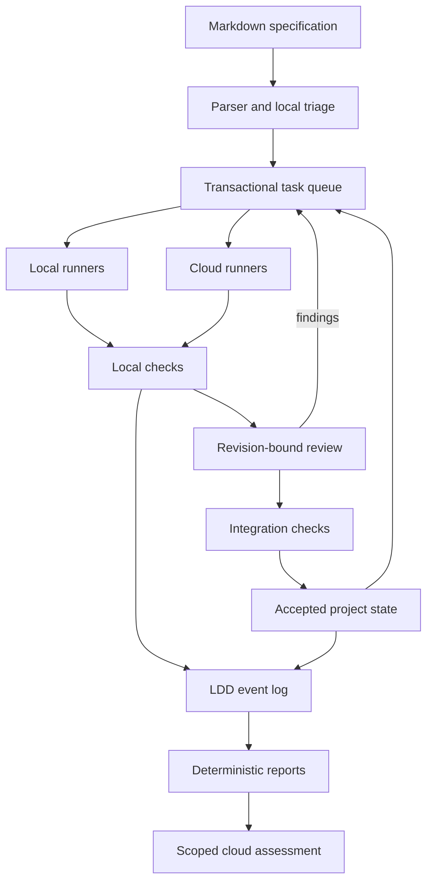

# Architecture and invariants

The local station owns task state. Markdown is an import/export view; runner prose never proves completion.

| Module | Responsibility |
|---|---|
| `contracts.py` | Manifest validation, DAG checks, bounded paths and LDD envelopes |
| `store.py` | SQLite WAL, transactions, exclusive leases, event chains, artifacts, reports and call reservations |
| `workspace.py` | Isolated Git worktrees, file proposals and acceptance checks |
| `service.py` | Dependency waves, local/cloud execution, review, integration and cloud assessments |
| `models.py` | RESIDUAL HTTP providers, role-specific prompts, model setup and Ollama lifecycle |
| `server.py` | Local HTTP API, session/Host/Origin enforcement and static UI |
| `worker.py` | Additional inference-only machines |

## Correctness boundaries

1. A model proposes a `files` object containing complete UTF-8 contents for declared writable paths. It cannot add commands or change the check specification.
2. Claims occur under a SQLite write transaction. Each attempt gets an exclusive 15-minute lease. Remote workers renew it every minute; stale results are rejected before file writes.
3. Candidates are committed before checks. Tests must leave a clean tree. Check receipts bind the spec hash, base revision, candidate revision and outcomes.
4. Review reads actual code, declared context, the diff and check outcomes. Approval binds to the exact revisions and check hash.
5. A moved integration base invalidates approval. A not-yet-reviewed candidate may be rebased only if its declared read/write paths did not change; it is then checked and reviewed again. Undeclared semantic dependencies remain the task author's responsibility.
6. Already integrated tasks' checks plus the candidate checks run on the proposed integrated tree before fast-forward integration. Source release export does not deploy to production.
7. Reports are factual projections generated without inference. Cloud-enabled live batches automatically request an assessment when a cloud model is configured. Assessments receive different role-specific views and acknowledge their checkpoint only after all three role calls succeed.
8. Coordinator-issued model calls reserve budgets before transport. Failed calls retain their reservation. Missing provider usage stays unknown. Remote usage is separately labeled worker-reported; worker machines enforce their own provider budgets.
9. Hash-linked events detect changes relative to a retained trusted root. They are not signatures, tamper-proof storage, or authenticated execution proofs.

## Concurrency and recovery

The station uses `BEGIN IMMEDIATE` for writes and serializes Git integration per project. Implementation requests run in parallel. A batch permits three attempts per task, five lifetime claims, and bounded project model-call budgets. Long dependency chains run in waves; blocked tasks remain available for operator diagnosis. Pausing stops new assignments and integration, while active requests may finish.

On restart, interrupted local attempts and triage operations become blocked for re-triage without losing artifacts. Unexpired remote leases remain valid; expired leases are recovered. Interrupted background operations are labeled interrupted, not completed.

Completed remote submission IDs are idempotent. A crash between accepting a candidate and recording the submission receipt may return a stale-lease error on retry; it cannot rewrite an already completed task. SQLite and Git do not share a transaction. A process dying after a Git fast-forward but before the database transition requires operator inspection/recovery; exactly-once integration across this boundary is not claimed.

## Execution boundaries

Built-in existence/text/AST/JSON checks do not execute generated code. Project command checks are explicitly enabled at import. They run without a shell, with bounded time, stripped environment credentials and temporary HOME. **Native checks are not an OS sandbox:** code can access files available to that process.

Docker mode provides a container boundary with no Docker socket, dropped capabilities, a non-root user and read-only imported repositories. Do not give generated code sensitive host mounts or secrets. Network egress is not blocked inside that container. The included Python and Node toolchains support those languages; other dependencies/toolchains require a derived image or configured native host.

The app binds to loopback; Compose publishes only to loopback. API writes require a session token and accepted Host/Origin. Worker credentials are separate and revocable. The local settings database stores API keys within the protected station data directory; it is not encrypted by an external keychain. API keys are never returned to the browser or included in project exports.

This is a trusted, single-user local app, not a hardened multi-tenant internet service. Use a TLS reverse proxy or SSH tunnel for trusted remote workers.

## Provider and observation integration (0.3)

Configured inference routes now enter `ai_providers.Router` through `residual.modular.ModularProvider` (original CLI/remote runner) or station role dispatch. Each station attempt has pre-transport budget admission and a mandatory LDD usage receipt. Optional provider observations are stored separately; workflow observations reference the authoritative LDD event ID and hash. `observation_layer` supplies contracts, bus interfaces, filters, sinks and verification. `residual.station.observability` supplies atomic SQLite sequencing, persisted checkpoints and the Diagnostics read API. See [the full integration guide](MODULAR-LAYERS.md).
