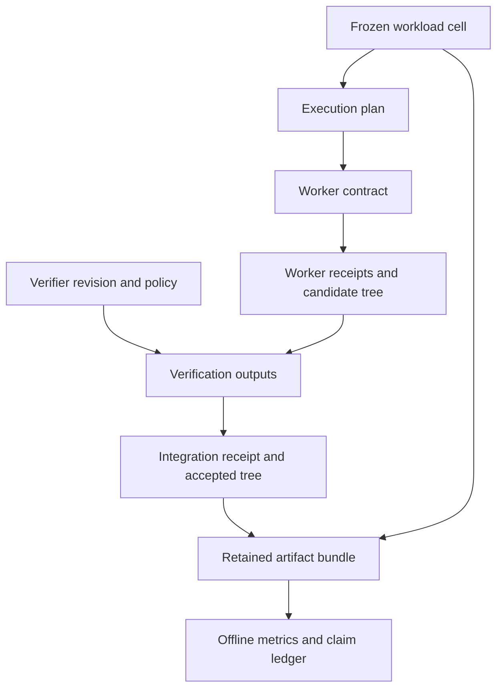

# Evidence pipeline (architecture template; no execution claimed)

Every arrow is a required hash-bound reference to audit, not proof of an
implemented edge. Independent grades and the externally retained bundle digest
must accompany the reconstruction. Metrics do not write accepted state.
