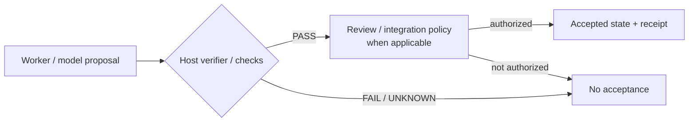
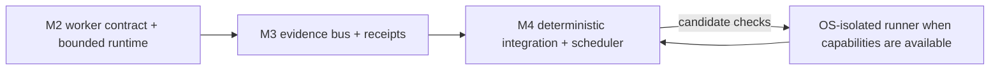

# RESIDUAL architecture diagrams — specification reference

**Status:** non-normative reference
**Validated against:** `main@260b5f9e20bf70a6b9ca087bc91e22a009ed77b9`

The earlier file duplicated a September 13 ASCII snapshot and had drifted from the implemented repository. The maintained human-readable diagram set now lives in [`../docs/enterprise/ARCHITECTURE_DIAGRAMS.md`](../docs/enterprise/ARCHITECTURE_DIAGRAMS.md). Binding specifications remain in this directory; diagrams do not override code, tests, ownership baselines, or retained qualification evidence.

## Authority model

## Factory layering

For repository-wide topology, Command Station repair flow, Mission Control/WebVM provider boundaries, deployment shapes, and evidence/authority boundaries, use the maintained diagram set linked above.
